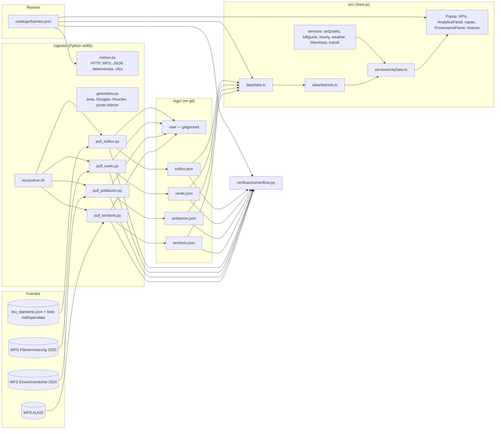

# Design Document

## Overview

Este diseño reemplaza las métricas por distrito escritas a mano en CerebroBerlin por datos oficiales servidos desde un lago versionado y verificado, y corrige el cálculo del EAQI. Sigue el flujo de la guía "Taller de datos": rastreo (`catalogo/`), ingesta reproducible (`ingesta/`), lago (`lago/`), verificación con puerta de publicación (`verificacion/`) y vistas con procedencia.

Decisiones principales:

- **Dos mundos separados.** Los datos de cambio lento (límites, población, edad, % verde, perfil de tráfico) se descargan con scripts Python de biblioteca estándar, se normalizan al Contrato_del_Lago y se confirman en git. La Aplicación los importa como JSON en tiempo de compilación (`resolveJsonModule` ya está activo) con Origen_de_Dato `snapshot`. Los datos de cambio rápido (Open-Meteo, Luftgüte, GBFS, VBB) se consultan en tiempo de ejecución con `safeFetchJson` y degradan a mock etiquetado `simulado`.
- **El Catálogo es la única fuente de metadatos de fuente.** Los scripts copian `{id, nombre, url, estado, licencia}` y la `vigencia` desde `catalogo/fuentes.json`; la Aplicación resuelve la procedencia de cualquier cifra por el id de fuente contra el mismo Catálogo. Así 2.3 (coincidencia lago–catálogo) se cumple por construcción y el Verificador solo lo confirma.
- **Una única definición del EAQI** (`src/lib/eaqi.ts`) usada por servicios, mock, capas, `aqiTone` y gráficos. Se elimina `pm25ToAqi` y los cortes US EPA.
- **Funciones puras para todo lo verificable.** Agregaciones Python (población, verde, tráfico, geometría) y construcción TypeScript (distritos, KPIs, serie 24 h, hora de Berlín, procedencia) son funciones puras con pruebas basadas en propiedades.
- **Se conserva el mapa 3D** (`mapStyle.ts`), pero la altitud fija común `DATA_ELEVATION_M` y `onTerrain()` se eliminan: cada punto de las capas deck.gl se dibuja a la elevación del terreno en su propia coordenada, muestreada con `map.queryTerrainElevation` a través de un `ElevationSampler`, con respaldo 0 m mientras la tesela DEM no está cargada (20.7–20.9).
- **EAQI explicado en un solo sitio.** Un único `EaqiPanel` (Panel_EAQI) y un único control `EaqiInfoButton` (Control_de_Definición_EAQI) junto a cada valor de EAQI y cada etiqueta de banda. Como los tooltips de deck.gl solo responden al puntero, los tooltips del mapa se pueden **fijar** como tarjetas interactivas y los distritos y estaciones son alcanzables por teclado desde una lista en la barra lateral (10.11, 10.12, 17.6).
- **Lo simulado se ve.** Un componente compartido `OriginBadge` marca "simulado" solo los valores con origen `mock` (11.9–11.12); las capas de ejemplo están ocultas por defecto y solo las enciende el usuario (19.4, 19.5).

Hechos de fuentes verificados el 2026-10-07 que este diseño asume: WFS ALKIS `alkis_bezirke:bezirksgrenzen` (EPSG:4326 para geometría, EPSG:25833 por defecto para área); WFS `ua_einwohnerdichte_2024:ua_einwohnerdichte_2024` (`schluessel`, `ew2024`, grupos `alter_*`, nulos = sin desglose de edad); WFS `ua_flaechennutzung_2020:c_ua_realnutz_2020` (`bez`, `flalle`, `nutz`, `nutzung`); Verkehrsdetektion `teu_standorte.json` (538 detectores, `teuID`) y blob `mdhopendata` con `detektor_2025_06.tgz` (un CSV por detector `2025_06/<teuID>.csv`, separador `;`, columnas "Stunde des Tages (Ortszeit)" y `qkfz`, valores `NaN`); VBB transport.rest devuelve HTTP 503.

## Architecture



### Anatomía del repositorio

```
catalogo/fuentes.json            # Fichas de fuente (rastreo, escrito a mano: es documentación)
ingesta/
  comun.py                       # utilidades compartidas
  geometria.py                   # geometría planar pura
  pull_territorio.py             # ALKIS → lago/territorio.json
  pull_poblacion.py              # Einwohnerdichte 2024 → lago/poblacion.json
  pull_suelo.py                  # Flächennutzung 2020 → lago/verde.json
  pull_trafico.py                # Verkehrsdetektion → lago/trafico.json
  reconstruir.sh                 # borra, reconstruye, verifica, muestra diff
  test_comun.py, test_geometria.py, test_agregados.py
lago/
  territorio.json, poblacion.json, verde.json, trafico.json
  raw/                           # descargas originales (gitignored, fuera del contexto Docker)
verificacion/
  verificar.py
  test_verificar.py
```

Cambios de configuración:

- `.gitignore`: añadir `/lago/raw/`.
- `.dockerignore`: añadir `lago/raw` (archivos grandes); `lago/` y `catalogo/` NO se excluyen (2.8). El `Dockerfile` ya copia el contexto completo (`COPY . .`) y los JSON quedan incrustados en el bundle por el import estático.
- `tsconfig.json`: añadir alias `"@lago/*": ["./lago/*"]` y `"@catalogo/*": ["./catalogo/*"]` (Vitest los resuelve con `vite-tsconfig-paths`).
- `vitest.config.ts`: `esbuild: { jsx: "automatic" }`, porque `tsconfig.json` usa `"jsx": "preserve"` (Next) y las pruebas de render con `react-dom/server` importan componentes `.tsx`; el entorno sigue siendo `node`.
- `package.json`: `fast-check` como devDependency con versión exacta (sin `^`). Tras añadirla hay que reconstruir la imagen dev (`docker compose --profile dev build web-dev`), porque `node_modules` vive en un volumen anónimo.

### Flujo de reconstrucción

`ingesta/reconstruir.sh` (con `set -euo pipefail`):

```sh
#!/usr/bin/env bash
set -euo pipefail
cd "$(dirname "$0")/.."
rm -f lago/*.json
for s in ingesta/pull_territorio.py ingesta/pull_poblacion.py ingesta/pull_suelo.py ingesta/pull_trafico.py; do
  python3 "$s"
done
python3 verificacion/verificar.py
git diff --stat -- lago/
```

Si un script falla, el comando termina con código distinto de cero (3.9); el lago parcialmente borrado se restaura con `git checkout -- lago/`. Ejecutado individualmente, un script que falla no toca su Tema (3.8) porque la escritura es atómica y solo ocurre al final. Cualquier error HTTP de cualquier fuente, sea cual sea su código de estado, termina en `IngestaError` y en código de salida 1 (ver `http_get` y `main_seguro`); no hay códigos ni fuentes exentos.

### Flujo de la Aplicación

`fetchCityData()` ejecuta en paralelo: `fetchDistricts` (lago, síncrono), `fetchAirQuality` (Open-Meteo por distrito), `fetchAirStations` (Luftgüte), `fetchHourly` (Open-Meteo horario), `fetchWeather`, `fetchBikeshare`, `fetchTransit`. Después compone `timeSeries` con `buildTimeSeries(perfilTráfico, hourly)`. Los datos de ejemplo (hotspots, infraestructura) se adjuntan con origen `example`. Los KPIs y agregados se calculan en `buildAnalytics(data, hour)` (función pura) envuelta por `useAnalytics`. En el mapa, `useTerrainElevation` aporta `{ sampler, elevationVersion }` a `buildDeckLayers`; hover y clic producen un `MapTarget` cuyo contenido calcula `tooltipFor`; el clic (o un botón de `MapObjectList`) lo fija en el store.

## Components and Interfaces

### Python: `ingesta/comun.py`

```python
USER_AGENT = "CerebroBerlin-ingesta/1.0 (taller de datos; contacto en README)"
RAIZ = Path(__file__).resolve().parent.parent
LAGO, RAW, CATALOGO = RAIZ / "lago", RAIZ / "lago" / "raw", RAIZ / "catalogo" / "fuentes.json"

class IngestaError(Exception): ...

def http_get(url: str, intentos: int = 3, timeout: int = 60) -> bytes:
    """GET con User-Agent. Toda respuesta que no sea 2xx es un error (3.8),
    sin excepción por código ni por fuente:
      - 4xx (400, 403, 404, 429, …): IngestaError inmediato, sin reintento;
        no se intenta eludir bloqueos (1.11).
      - 5xx y errores de red (URLError, timeout, conexión reiniciada):
        hasta `intentos` intentos con espera 2 s, 4 s, 8 s; si el último
        falla, IngestaError.
      - cualquier otro código no 2xx que urllib no resuelva (p. ej. 3xx sin
        Location): IngestaError inmediato.
    El mensaje incluye URL, código de estado y los primeros 300 bytes del
    cuerpo (el error exacto). Nunca devuelve un cuerpo de error como datos."""

def wfs_url(base: str, type_name: str, *, property_names: list[str] | None = None,
            count: int | None = None, start_index: int | None = None,
            srs_name: str | None = None, result_type: str | None = None) -> str:
    """GetFeature WFS 2.0.0, outputFormat=application/json. Con property_names
    no se pide la geometría."""

def paginas(total: int, count: int) -> list[int]:
    """startIndex de cada página: [0, count, 2·count, …] < total."""

def wfs_total(base: str, type_name: str) -> int:
    """resultType=hits → numberMatched."""

def wfs_todas(base, type_name, property_names, count=5000) -> list[dict]:
    """Descarga todas las páginas, guarda cada una en lago/raw/ y devuelve
    las properties. Si len(resultado) != wfs_total → IngestaError (5.7)."""

def guardar_raw(nombre: str, contenido: bytes) -> Path: ...

def ficha(id_fuente: str) -> dict:
    """Ficha del catálogo; IngestaError si no existe."""

def fuente_de(id_fuente: str) -> dict:
    """{id, nombre, url, estado, licencia} copiados de la ficha."""

def redondear(valor: float, unidad: str) -> float | int:
    """Redondeo fijo por unidad: hab→0, %→1, km²→2, veh/h→1, °→5 decimales."""

def cifra(valor, unidad: str, vigencia: str, fuente: str) -> dict:
    """{"valor", "unidad", "vigencia", "fuente"} con valor redondeado según la unidad."""

def hoy() -> str:
    """Fecha ISO del día; admite CEREBRO_FECHA para pruebas."""

def serializar(obj) -> str:
    """json.dumps(sort_keys=True, ensure_ascii=False, indent=2) + "\\n"."""

def escribir_tema(nombre: str, tema: dict) -> Path:
    """Escritura atómica: tmp en el mismo directorio + os.replace."""

def main_seguro(fn) -> None:
    """Ejecuta fn(). Ante IngestaError (cualquier error HTTP de 4xx inmediato
    o de 5xx tras reintentos, o contenido no esperado) imprime el error
    exacto en stderr y llama a sys.exit(1). Cualquier otra excepción imprime
    la traza y también sale con 1. Como escribir_tema solo se invoca al final
    de fn(), el Tema existente queda intacto en todos estos casos (3.8)."""
```

### Python: `ingesta/geometria.py`

```python
def area_anillo(anillo: list[tuple[float, float]]) -> float          # shoelace, valor absoluto
def area_poligono(poligono: list[list[tuple]]) -> float               # exterior − huecos
def area_multipoligono(mp: list[list[list[tuple]]]) -> float
def douglas_peucker(linea: list[tuple], tolerancia: float) -> list[tuple]   # iterativo, conserva extremos
def simplificar_anillo(anillo, tolerancia) -> list[tuple]             # mantiene cierre y ≥ 4 vértices
def punto_en_poligono(p, poligono) -> bool                            # ray casting con huecos
def punto_interior(mp) -> tuple[float, float]
    """Parte de mayor área; recta horizontal en la latitud media de su bbox
    (si cae en un vértice se desplaza un épsilon determinista); intersecciones
    con todos los anillos ordenadas; punto medio del tramo interior más ancho."""
def redondear_coords(geom, decimales=5)
```

### Python: scripts de ingesta

| Script | Fuente (id catálogo) | Descarga | Salida |
|---|---|---|---|
| `pull_territorio.py` | `alkis-bezirke` | 2 GetFeature: `srsName=EPSG:4326` (geometría) y por defecto EPSG:25833 (área) | `territorio.json` |
| `pull_poblacion.py` | `ua-einwohnerdichte-2024` | `wfs_todas` con `propertyName=schluessel,ew2024,alter_*` | `poblacion.json` |
| `pull_suelo.py` | `ua-flaechennutzung-2020` | `wfs_todas` con `propertyName=bez,flalle,nutz,nutzung` | `verde.json` |
| `pull_trafico.py` | `verkehrsdetektion` | `teu_standorte.json` + `detektor_2025_06.tgz` | `trafico.json` |

Funciones puras expuestas por cada script (importables por los tests; la E/S queda en `main()`):

```python
# pull_territorio.py
def codigo_de(props: dict) -> str            # gem "001"–"012" → "01"–"12"; fuera de rango → IngestaError
def construir_territorio(f4326: list, f25833: list, probado: str, vigencia: str) -> dict
def simplificar_hasta(features, limite_bytes=200_000) -> tuple[list, float]
    """Tolerancia inicial 0.00005°, se duplica hasta que la geometría serializada
    (separators=(",", ":")) mida ≤ 200 KB. Determinista."""

# pull_poblacion.py
GRUPOS_MENOR_18 = ("alter_u6", "alter_6_u10", "alter_10_u18")
GRUPOS_65_MAS = ("alter_65_u70", "alter_70_u75", "alter75_u80", "alter_80plus")
def agregar_poblacion(bloques: list[dict]) -> dict[str, dict]
    """Por código (codigo_distrito(schluessel)): poblacion, pob_con_edad, menor_18, mas_65, bloques.
    Un bloque con cualquier grupo de edad nulo suma a poblacion pero no a pob_con_edad."""
ANTIGUO_A_ACTUAL: dict[str, str]             # distrito anterior a 2001 (01–23) → Código_de_Distrito (01–12)
def codigo_distrito(schluessel) -> str       # ANTIGUO_A_ACTUAL[schluessel[:2]]; prefijo desconocido → IngestaError
def porcentajes(agg: dict) -> dict          # pct_menor_18, pct_65_mas, cobertura_edad

# pull_suelo.py
NUTZ_VERDE = {100, 130, 150, 160, 172, 173}
CLASIFICACION: dict[int, bool]               # tabla explícita de TODOS los códigos observados
def normalizar_bez(bez) -> str               # 1 | "1" | "01" | "001" → "01"; fuera de 1–12 → IngestaError
def clasificar(nutz) -> bool                 # código no listado → IngestaError("nutz no clasificado: X")
def pct_verde(bloques: list[dict]) -> dict[str, dict]   # superficie_verde, superficie_bloques, pct

# pull_trafico.py
MES = "2025-06"                              # 7.1, 7.7
def url_archivo(mes: str) -> str             # …/2025/neue_qualitaetssicherung/Fahrstreifendetektoren/detektor_2025_06.tgz
def meses_disponibles(xml_listado: bytes) -> list[str]   # ?restype=container&comp=list&prefix=<año>/
MIN_REGISTROS_POR_HORA = 3                   # 7.3: filas válidas mínimas por detector y hora del día
def registros_por_hora(filas: Iterable[dict]) -> list[int]          # 24 enteros: nº de filas con qkfz válido
def medias_por_hora(filas: Iterable[dict], min_registros=MIN_REGISTROS_POR_HORA) -> list[float | None]
    # 24 valores; NaN y vacíos descartados; hora con < min_registros filas válidas → None
def horas_descartadas(registros: dict[str, list[int]], min_registros=MIN_REGISTROS_POR_HORA) -> int
    # nº de horas-detector con 1 ≤ filas válidas < min_registros
def leer_archivo(tgz: bytes) -> tuple[dict[str, list[float | None]], dict[str, list[int]]]  # (medias, registros); tarfile + csv(delimiter=";")
def perfil_ciudad(medias: dict[str, list]) -> list[float]          # media por hora de las medias no nulas
def unir_ubicaciones(medias, standorte) -> tuple[list[dict], int]  # (detectores con punto, nº excluidos)
```

`pull_trafico.py` usa `meses_disponibles` solo para informar por consola si existe un mes más reciente que `MES`; ese dato no se escribe en el lago para no romper el determinismo (3.6, 3.7). Si `teu_standorte.json` no tiene la estructura esperada (lista con `teuID` y coordenadas) o el CSV carece de las columnas, el script termina con IngestaError.

Umbral de registros (7.3, 7.4): la media de un detector en una hora del día solo cuenta si ese detector tiene al menos `MIN_REGISTROS_POR_HORA` = 3 filas válidas (`qkfz` no `NaN` ni vacío) para esa hora en el mes; si no, esa hora del detector es `null`: no entra en `perfil_ciudad` y aparece como `null` en `series.detectores`. Motivo: en junio de 2025 hay 172 detectores con una única fila en el mes (2025-06-25 10 h, `qkfz` = 0, `Datapoints_Rel` = 0,08) que bajaban la media de ciudad de las 10 h a 182,3 veh/h. El umbral se registra como cifra `min_registros_por_hora` (unidad `registros`) y las horas-detector descartadas (con 1 o 2 filas válidas, de todos los detectores del archivo) como `detector_horas_descartadas` (unidad `detector-horas`), ambas con la vigencia y fuente del Tema.

### Python: `verificacion/verificar.py`

```python
@dataclass
class Resultado:
    nombre: str
    ok: bool
    detalle: str = ""

def comprobar_catalogo(catalogo: list[dict]) -> list[Resultado]          # 1.2–1.4, 8.8, ids únicos
def comprobar_tema(nombre: str, tema: dict, catalogo_por_id: dict) -> list[Resultado]  # 2.x, 8.2–8.5
def recorrer_cifras(obj, ruta="") -> Iterator[tuple[str, dict]]          # todo dict con "valor", a cualquier profundidad
def comprobar_personales(obj) -> list[Resultado]                         # 8.6, 8.7
def comprobar_dominio(temas: dict[str, dict]) -> list[Resultado]         # 9.1–9.7, tamaño geometría
def verificar(lago: Path, catalogo: Path) -> list[Resultado]
def codigo_salida(resultados: list[Resultado]) -> int    # 1 si hay algún FAIL, si no 0
def imprimir(resultados, salida: TextIO) -> None          # "PASS x" / "FAIL x: detalle"
def main(argv=None, salida: TextIO | None = None) -> int

if __name__ == "__main__":
    raise SystemExit(main())
```

Código de salida (8.9, 8.11–8.13). `main` ejecuta todas las comprobaciones, calcula `codigo = codigo_salida(resultados)` **antes** de imprimir nada y lo devuelve pase lo que pase con la impresión:

```python
def main(argv=None, salida=None) -> int:
    args = _parsear(argv)
    resultados = verificar(args.lago, args.catalogo)   # nunca lanza: JSON ilegible → FAIL
    codigo = codigo_salida(resultados)                 # depende solo del nº de FAIL
    try:
        imprimir(resultados, salida or sys.stdout)
        (salida or sys.stdout).flush()
    except Exception as exc:                           # BrokenPipeError, UnicodeEncodeError, OSError…
        try:
            sys.stderr.write(f"verificar: no se pudo imprimir ({type(exc).__name__}); FAIL={_n_fail(resultados)}\n")
        except Exception:
            pass
        _silenciar_stdout()                            # os.dup2(devnull, stdout) para que el flush al salir no falle
    return codigo
```

`raise SystemExit(main())` convierte el valor devuelto en el estado de salida del proceso (8.12). `_silenciar_stdout` evita que el flush final del intérprete ante una tubería cerrada sustituya el código por 120. Si la impresión falla y hay al menos un FAIL, el proceso sale con 1 (8.13); si no hay FAIL, la puerta sigue abierta (0).

Reglas concretas:

- **Cifra:** todo dict que contenga `valor` debe tener `unidad`, `vigencia` y `fuente` no vacíos; `fuente` ∈ ids de `fuentes` del tema y del catálogo; `valor` no puede ser cadena (2.4); si `unidad == "%"`, todo valor numérico debe estar en [0, 100] (9.6).
- **Tema:** claves `tema`, `probado`, `fuentes`, `cifras`; `probado` valida con `date.fromisoformat` y regex `^\d{4}-\d{2}-\d{2}$`; cada entrada de `fuentes` con id, nombre, url, estado y licencia no vacíos e iguales a la ficha del catálogo.
- **Catálogo:** 13 campos obligatorios; `estado` ∈ {integrado, candidato, caído, declarado, excluido}; `personas` ∈ {no, conteos agregados por zona, personas identificables, texto libre}; toda ficha `integrado` debe cumplir **al menos una** de dos condiciones, sin exigir ambas (1.10): (a) su id aparece en el arreglo `fuentes` de algún Tema del lago (los Temas solo los escriben Scripts_de_Ingesta, así que equivale a "descargada por un script"), **o** (b) su `uso` empieza por `en vivo:` (consultada en tiempo de ejecución por la Aplicación). Regla: `FAIL ⇔ estado == "integrado" ∧ ¬(a) ∧ ¬(b)`; cumplir (a) y (b) a la vez también es PASS.
- **Datos personales:** claves prohibidas (comparación normalizada en minúsculas, sin acentos): `vorname, nachname, apellido, apellidos, first_name, last_name, nombre_persona, email, e_mail, correo, telefono, telefon, phone, direccion, address, adresse, fecha_nacimiento, geburtsdatum, birthdate`. Textos: email `[\w.+-]+@[\w-]+\.[\w.-]{2,}`; teléfono `(?:\+|\b0)\d[\d /-]{6,}\d` con al menos 9 dígitos. Las claves `url` se omiten. `nombre` no se prohíbe porque designa fuentes y distritos.
- **Dominio:** `por_distrito` de territorio, población y verde con claves exactamente `01`–`12`; `geometria` con 12 features de códigos `01`–`12`; población total en [3 400 000, 4 200 000] y igual a la suma de distritos; |Σ área − 891,1| ≤ 8,911 km²; toda coordenada bajo claves `coordinates` o `punto` dentro de lon 13,08–13,77 y lat 52,33–52,68; `series.perfil_ciudad.valor` con 24 números ≥ 0; geometría serializada ≤ 200 KB.

### TypeScript: módulos nuevos y modificados

| Módulo | Responsabilidad |
|---|---|
| `src/lib/eaqi.ts` (nuevo) | Umbrales, `subIndex`, `eaqiRaw`, `eaqi`, `eaqiBand`, `EAQI_BANDS`. Única definición. |
| `src/lib/format.ts` | `aqiTone(v: number \| null)` delega en `eaqiBand`; `formatNullable`; se mantiene `abbreviate`, `formatHour`. |
| `src/lib/time.ts` (nuevo) | `berlinHour(date?)`, `BERLIN_TZ_LABEL = "hora de Berlín"`. |
| `src/lib/catalog.ts` (nuevo) | Importa `@catalogo/fuentes.json`, tipa `SourceCard`, `catalogById`. |
| `src/lib/metrics.ts` (nuevo) | `METRICS`: id, label, unit, definition, sourceId, vigencia. Única definición de métricas. |
| `src/lib/provenance.ts` (nuevo) | `resolveProvenance(ref)`, `originLabel(origin)`, `originBadge(origin)`, `attributionsFor(sourceIds)`, `footerSources(catalog)`. |
| `src/lib/terrain.ts` (nuevo) | `ElevationSampler`, `absoluteElevation`, `withElevation`, `elevateGeometry`, `createMapElevationSampler(map)`. Sin dependencias de React. |
| `src/lib/tooltips.ts` (nuevo) | `tooltipFor(target, data, hour)` pura: filas del tooltip (con marca EAQI, origen y ejemplo) compartidas por el tooltip flotante y la tarjeta fijada. |
| `src/hooks/useTerrainElevation.ts` (nuevo) | Crea el sampler sobre el `MapRef`, escucha eventos del mapa y expone `{ sampler, elevationVersion }`. |
| `src/lib/gaps.ts` (nuevo) | `buildGaps(catalog, districts)` → Lista_de_Huecos. |
| `src/lib/analytics.ts` (nuevo) | `buildAnalytics(data, hour)` pura (KPIs y agregados) y `districtAqiBars(data)` pura: modelo de las 12 barras `{ code, name, aqi, band, origin, eaqi: true }` que consume el gráfico "AQI por distrito". |
| `src/data/lake.ts` (nuevo) | Importa los 4 temas, tipos del contrato, `trafficProfile`, `trafficDetectors`. |
| `src/data/districts.ts` | `buildDistricts(territorio, poblacion, verde)`; `BERLIN_DISTRICTS`, `DISTRICT_LIST`. Sin `halfW/halfH`. |
| `src/data/mock.ts` | Mock posicionado en `point`; `MOCK_AIR` y `MOCK_AIR_STATIONS` con `eaqi()`; `MOCK_HOURLY`; se elimina `buildTimeSeries` sintético. |
| `src/lib/services/airQuality.ts` | Por distrito en `point`, por código, contaminantes nulos. Sin `pm25ToAqi`. |
| `src/lib/services/luftguete.ts` (nuevo) | `/api/stations` + 4 componentes; último valor por estación; EAQI. |
| `src/lib/services/hourly.ts` (nuevo) | Curvas 24 h de EAQI y temperatura. |
| `src/lib/services/timeSeries.ts` (nuevo) | `buildTimeSeries(profile, hourly)` pura. |
| `src/lib/services/openData.ts` | `fetchDistricts` → `{ data, origin: "snapshot", vigencia, probado }`. |
| `src/lib/services/weather.ts` | Usa `point` del lago. |
| `src/lib/services/cityData.ts` | Compone el `CityDataset` ampliado. |
| `src/lib/layers.ts` | Capas `traffic`, `airStations`; `example: true` y `defaultVisible: false` en hotspots/infraestructura (constantes por tipo de capa). |
| `src/lib/mapStyle.ts` | Se elimina `DATA_ELEVATION_M` (y `BERLIN_MEAN_ELEVATION_M`); se exporta `TERRAIN_SOURCE_ID` para que el sampler filtre eventos `sourcedata`. `TERRAIN_EXAGGERATION` se mantiene. |
| `src/components/map/buildDeckLayers.ts` | `hour`, `sampler` y `elevationVersion` en lugar de `activity`; `withElevation` en cada `getPosition`; capas de detectores y estaciones; `air` pasa a `ScatterplotLayer`; hover y clic emiten `MapTarget`. |
| `src/components/map/MapContainer.tsx` | Pasa `hour`, sampler y versión; se elimina la "actividad" gaussiana sintética; clic fija el tooltip. |
| `src/components/map/MapTooltip.tsx` | Modo `hover` (no interactivo, `pointer-events-none`) y modo `pinned` (tarjeta interactiva con foco). |
| `src/components/map/DistrictPopup.tsx` | Nuevas métricas con vigencia, origen, `OriginBadge`, `EaqiInfoButton` y botón de procedencia. |
| `src/components/provenance/ProvenanceButton.tsx`, `ProvenancePanel.tsx` (nuevos) | Procedencia a un clic, accesible. |
| `src/components/eaqi/EaqiPanel.tsx`, `EaqiLegend.tsx`, `EaqiInfoButton.tsx`, `EaqiBandLabel.tsx` (nuevos) | Panel_EAQI único, leyenda reutilizada dentro del panel, Control_de_Definición_EAQI y etiqueta de banda con su control. |
| `src/components/provenance/OriginBadge.tsx` (nuevo) | Insignia de Origen_de_Dato compartida; variante "simulado" destacada. |
| `src/components/panels/KpiCards.tsx`, `AnalyticsPanel.tsx`, `TimelineControl.tsx`, `LayerController.tsx` | KPIs reales, gráficos, hora de Berlín, etiquetas de ejemplo. |
| `src/components/panels/GapsList.tsx` (nuevo) | Lista_de_Huecos en la barra lateral. |
| `src/components/panels/MapObjectList.tsx` (nuevo) | Lista de distritos y estaciones con botones: acceso por teclado a los tooltips fijados. |
| `src/components/layout/Sidebar.tsx` | Insignias por Origen_de_Dato, huecos, `MapObjectList`, pie con `footerSources` (integradas con atribución y no integradas marcadas). |
| `src/components/layout/AppShell.tsx` | Monta una sola instancia de `EaqiPanel` y de `ProvenancePanel`. |
| `src/store/useCityStore.ts` | `provenance`, `openProvenance`, `closeProvenance`; `eaqiPanel: { open, returnFocusTo }`, `openEaqiPanel`, `closeEaqiPanel`; `pinned: PinnedTarget \| null`, `pin`, `unpin`; visibilidad inicial de capas de ejemplo forzada a `false`. |
| `src/hooks/useTimelinePlayer.ts` | Hora inicial `berlinHour()`. |

#### `src/lib/eaqi.ts`

```ts
export type Pollutant = "pm25" | "pm10" | "no2" | "o3";

/** Umbrales horarios en µg/m³ (Open-Meteo, EuropeanAirQuality). */
export const EAQI_THRESHOLDS: Record<Pollutant, readonly number[]> = {
  pm25: [0, 5, 15, 50, 90, 140],
  pm10: [0, 15, 45, 120, 195, 270],
  no2: [0, 10, 25, 60, 100, 150],
  o3: [0, 60, 100, 120, 160, 180],
};

/** Subíndice: (índice de tramo + posición lineal en el tramo) × 20.
 *  Por encima del último umbral extrapola con el último tramo. */
export function subIndex(p: Pollutant, c: number): number {
  const t = EAQI_THRESHOLDS[p];
  const x = Math.max(0, c);
  let i = 0;
  while (i < t.length - 2 && x >= t[i + 1]) i++;
  return (i + (x - t[i]) / (t[i + 1] - t[i])) * 20;
}

export type Concentrations = Partial<Record<Pollutant, number | null>>;

/** Máximo de los subíndices disponibles; null si no hay ningún valor finito. */
export function eaqiRaw(c: Concentrations): number | null { /* … */ }
/** eaqiRaw redondeado al entero (10.4: 19,5 PM2.5 + 104 O3 → 44). */
export function eaqi(c: Concentrations): number | null { /* … */ }

export interface EaqiBand { id: string; label: string; min: number; max: number | null; color: string; tone: "good" | "fair" | "moderate" | "poor" | "veryPoor" | "extreme" }
/** <20 Buena · [20,40) Razonable · [40,60) Moderada · [60,80) Mala · [80,100] Muy mala · >100 Extremadamente mala */
export const EAQI_BANDS: readonly EaqiBand[];
export function eaqiBand(v: number | null): EaqiBand | null;
```

`i` se detiene en `t.length - 2`, de modo que por encima de 140 µg/m³ (PM2.5) se usa el tramo [90, 140] y el subíndice sigue creciendo linealmente (10.2). Colores de banda: paleta EEA (`#50f0e6`, `#50ccaa`, `#f0e641`, `#ff5050`, `#960032`, `#7d2181`). La banda se calcula sobre el entero mostrado para que número y etiqueta coincidan.

#### `src/lib/time.ts`

```ts
const FMT = new Intl.DateTimeFormat("en-GB", {
  timeZone: "Europe/Berlin", hour: "2-digit", hourCycle: "h23",
});
/** Hora 0–23 en Europe/Berlin, independiente de la zona del navegador. */
export function berlinHour(date: Date = new Date()): number {
  const h = Number(FMT.formatToParts(date).find((p) => p.type === "hour")?.value);
  return Number.isFinite(h) ? h % 24 : date.getUTCHours();
}
```

`useTimelinePlayer` sigue aplicando la hora tras el montaje (evita desajustes de hidratación), pero con `berlinHour()`.

#### `src/lib/metrics.ts` y `src/lib/provenance.ts`

```ts
export type MetricId =
  | "population" | "density" | "area" | "pctUnder18" | "pct65Plus" | "ageCoverage"
  | "greenPct" | "aqiModel" | "aqiStation" | "traffic" | "bikes" | "temperature";

export interface MetricDef {
  id: MetricId;
  label: string;
  unit: string;
  definition: string;      // fórmula o definición mostrada en el Panel_de_Procedencia
  sourceId: string;        // id de ficha del catálogo
  vigencia?: string;       // tomada del lago al construir METRICS (no literal en vistas)
}
export const METRICS: Record<MetricId, MetricDef>;
```

Ejemplos de definiciones: `greenPct` = "Σ flalle de bloques con nutz 100 Wald, 130 Park/Grünfläche, 150 Friedhof, 160 Kleingarten, 172 y 173 Brache con vegetación ÷ Σ flalle de todos los bloques del distrito (superficie de bloques sin calles) × 100"; `density` = "población ÷ superficie ALKIS (EPSG:25833)"; `aqiModel` = "EAQI del modelo CAMS (Open-Meteo) en el punto representativo del distrito". Las vigencias se leen del lago (`cifra.vigencia`), no se escriben en el módulo.

```ts
export type Origin = "snapshot" | "live" | "mock" | "example";

export interface ProvenanceRef {
  metric: MetricId;
  origin: Origin;
  vigencia?: string;
  probado?: string;        // Fecha_Probado del tema (snapshot)
  fetchedAt?: string;      // momento de consulta (live)
  scope?: string;          // p. ej. "Mitte"
}

export interface ProvenanceCard {
  metric: MetricDef;
  source: { id: string; nombre: string; url: string; licencia: string; entidad: string };
  origin: Origin; originLabel: string;
  vigencia: string | null; probado: string | null; fetchedAt: string | null;
}

export function resolveProvenance(ref: ProvenanceRef): ProvenanceCard | null;
export function originLabel(o: Origin): string;
// snapshot → "snapshot del lago" · live → "en vivo" · mock → "simulado" · example → "datos de ejemplo (sin fuente)"

/** Atribuciones requeridas por licencia para las fuentes usadas por una vista. */
export function attributionsFor(sourceIds: readonly string[]): string[];

/** Insignia de origen; `simulated` es true solo para "mock" (11.12). */
export function originBadge(o: Origin): { text: string; simulated: boolean };

export interface FooterSources {
  integrated: { id: string; nombre: string; url: string; attribution: string }[];
  notIntegrated: { id: string; nombre: string; url: string; estado: Exclude<SourceState, "integrado"> }[];
}
/** Pie de la barra lateral (18.6–18.8): particiona TODO el catálogo por estado. */
export function footerSources(catalog: readonly SourceCard[]): FooterSources;
```

`attributionsFor` mapea la licencia de cada ficha: `dl-de-by-2.0` → "SenMVKU, Datenlizenz Deutschland – Namensnennung – Version 2.0"; CC BY 3.0 DE de Fuente_Población → "Amt für Statistik Berlin-Brandenburg, CC BY 3.0 DE"; Open-Meteo → "Open-Meteo, CC BY 4.0"; mapa → "© OpenStreetMap contributors · OpenFreeMap". `dl-de-zero-2.0` no exige atribución; en el pie se muestra "dl-de-zero-2.0 (sin atribución obligatoria)" para que toda fuente integrada lleve un texto de atribución no vacío.

`footerSources` recorre el catálogo completo, ordenado por id: las fichas `integrado` van a `integrated` con `attributionsFor([id])[0]`; las fichas `candidato`, `caído`, `excluido` y `declarado` van a `notIntegrated` con su estado. Las dos listas son disjuntas y su unión es el catálogo. OpenAQ solo puede aparecer en `notIntegrated` (con `excluido`), porque su ficha no es `integrado`; ya no existe ningún texto fijo que la mencione en el pie (18.6). Render del pie: sección "Fuentes integradas" (nombre enlazado + atribución) y sección "Catalogadas, no integradas" en estilo atenuado (`text-slate-500`), cada una con una insignia de estado (`caído`, `candidato`, `excluido`, `declarado`) y el prefijo textual "no integrada ·", de modo que la distinción no depende solo del color (18.7, 18.8).

#### Componentes de procedencia

- `ProvenanceButton({ refData, label })`: `<button type="button" aria-label={`Procedencia de ${label}`}>ⓘ</button>`; abre `openProvenance(ref)`. Accesible por teclado de forma nativa (17.6).
- `ProvenancePanel`: `role="dialog"`, `aria-modal="true"`, `aria-labelledby`; foco al botón de cierre al abrir, `Escape` cierra y devuelve el foco al disparador. Muestra métrica, definición, fuente (nombre como enlace a url, `rel="noopener noreferrer"`), licencia, vigencia, Fecha_Probado o momento de consulta, Origen_de_Dato (con `OriginBadge`). Si la métrica es `aqiModel` o `aqiStation`, no repite la definición del EAQI: incluye un `EaqiInfoButton` que abre el Panel_EAQI.
- `OriginBadge({ origin, compact? })`: usa `originBadge(origin)`. Para `mock` muestra "⚠ simulado" con fondo ámbar rayado (`bg-[repeating-linear-gradient(...)]`) y borde; para `snapshot`, `live` y `example` muestra su `originLabel` en estilo neutro. Con `compact` (tooltips, filas del gráfico) solo se renderiza si `simulated`, para no recargar; el texto "simulado" nunca aparece con otro origen (11.12). Incluye texto, no solo color.

#### Panel_EAQI y Control_de_Definición_EAQI (10.9–10.17)

- **Una sola instancia.** `EaqiPanel` se monta una vez en `AppShell`. Reutiliza `EaqiLegend` (tabla de umbrales por contaminante de `EAQI_THRESHOLDS`, la fórmula del subíndice y las seis `EAQI_BANDS` con color y rango), que no se usa en ningún otro sitio. `role="dialog"`, `aria-modal="true"`, `aria-labelledby` al título "Índice europeo de calidad del aire (EAQI)"; al abrir, foco al botón de cierre; `Escape` o el botón cierran y devuelven el foco a `returnFocusTo`. Si se abre sobre el Panel_de_Procedencia o una tarjeta fijada, se apila encima (z-index mayor) y `Escape` cierra solo el diálogo superior.
- **`EaqiInfoButton({ variant = "button" })`**: `<button type="button" aria-label="Definición del índice europeo de calidad del aire" aria-haspopup="dialog" onClick={(e) => openEaqiPanel(e.currentTarget)}>ⓘ</button>`. Botón nativo: Tab/Enter/Espacio sin código adicional (10.16, 10.17); foco visible con `focus-visible:ring`. `variant="hint"` renderiza el mismo glifo como `<span aria-hidden="true">` y solo se usa en el tooltip flotante no interactivo (ver más abajo), que nunca es la única vía.
- **`EaqiBandLabel({ value })`**: único componente autorizado a mostrar `aqiTone(v).label`; renderiza la etiqueta de banda seguida de un `EaqiInfoButton` (10.15). `aqiTone` sigue devolviendo clases y etiqueta, pero las vistas no imprimen `.label` directamente (lo comprueba una prueba).
- **Ubicaciones obligatorias** (cada una con su propio control, 10.10–10.15): Popup_de_Distrito (fila EAQI y su etiqueta de banda), tooltip de la Capa_de_Distritos, tooltip de la Capa_de_Estaciones, título del gráfico "AQI por distrito" ("AQI por distrito (EAQI) ⓘ") y su tooltip de barra, KPI EAQI (junto al valor), y toda etiqueta de banda vía `EaqiBandLabel`.

#### Tooltips fijables y acceso por teclado (decisión para 10.11, 10.12 y 17.6)

Problema: los tooltips de hover de deck.gl siguen al puntero, se dibujan con `pointer-events-none` y desaparecen al mover el ratón; no pueden recibir foco ni clic, así que un control dentro de ellos no sería operable con ratón ni con teclado.

Decisión:

1. **Contenido único y puro.** `tooltipFor(target, data, hour): TooltipContent` (`src/lib/tooltips.ts`) construye título y filas para `MapTarget = { kind, id }`. Una fila EAQI lleva `eaqi: true` y `origin`; las filas de capas de ejemplo llevan `example: true`. El tooltip flotante y la tarjeta fijada renderizan exactamente el mismo `TooltipContent`.
2. **Hover (puntero).** `MapTooltip mode="hover"` muestra las filas, el glifo ⓘ (`EaqiInfoButton variant="hint"`) junto a cada EAQI, el `OriginBadge` compacto y la pista "Clic para fijar". No es interactivo.
3. **Clic = fijar.** Un clic sobre un distrito, estación, detector u otro objeto llama a `pin({ kind, id, anchor: {x, y} })`. `MapTooltip mode="pinned"` se dibuja en `anchor` (limitado al viewport) como tarjeta interactiva: `role="dialog"` no modal, `aria-labelledby` al título, botón "Cerrar" y, junto a cada EAQI, un `EaqiInfoButton` real. Al fijar, el foco va al título de la tarjeta (`tabIndex={-1}`); `Escape` o "Cerrar" la desfijan y devuelven el foco al disparador (botón de lista) o al canvas. Mientras hay tarjeta fijada se suprime el hover del mismo objeto. El contenido se recalcula desde `data` y `hour` (no se congela) y la tarjeta se reancla con `map.project(punto)` en `move`.
4. **Distritos.** El clic en un distrito fija su tooltip **y** abre el Popup_de_Distrito (comportamiento actual conservado): la tarjeta fijada aparece junto al punto de clic y el popup en su posición fija arriba a la derecha, sin solaparse.
5. **Teclado sin puntero.** `MapObjectList` en la barra lateral ("Explorar el mapa") ofrece una lista de 12 botones de distrito y una de botones de estación (solo estaciones dibujadas, es decir, activas y con coordenadas finitas, 12.7). Activar un botón (Enter/Espacio) hace lo mismo que el clic: `pin` con `anchor = map.project(punto)` (si el punto queda fuera del viewport, la tarjeta se acopla abajo a la izquierda) y, para distritos, abre el Popup_de_Distrito. Así cada Control_de_Definición_EAQI de los tooltips de distrito y estación es alcanzable con Tab (10.11, 10.12, 10.17) y los controles de procedencia de popup y KPIs ya son botones nativos (17.6).

#### Elevación por punto sobre el terreno (20.7–20.9, 4.8)

Contexto verificado contra el código fuente: en MapLibre GL JS 4.7.1, `map.queryTerrainElevation(lngLat)` devuelve `null` sin terreno y, con terreno, `terrain.getElevationForLngLatZoom(p, tileZoom) − transform.elevation`, es decir, la **diferencia** respecto a la elevación del centro de la cámara, ambas ya multiplicadas por la exageración; mientras la tesela DEM no está cargada, la elevación de la tesela vacía es 0. `map.getCameraTargetElevation()` devuelve `transform.elevation`. `MapboxOverlay` de deck.gl 9 (no interleaved) con MapLibre fija la cámara en `position: [0, 0, map.transform.elevation]`, de modo que el z de deck.gl está en metros absolutos exagerados. Por tanto la cota correcta de un punto es `queryTerrainElevation(p) + getCameraTargetElevation()`. La tarea de implementación vuelve a comprobarlo contra la versión instalada de `maplibre-gl` (rango `^4.5.0`).

```ts
// src/lib/terrain.ts
export type ElevationSampler = (lng: number, lat: number) => number | null;

/** Cota absoluta (m × exageración) o null si no hay terreno o la tesela no está cargada.
 *  En Berlín (30–120 m) una cota ≤ 0 solo puede venir de la tesela DEM vacía. */
export function absoluteElevation(offset: number | null, cameraTarget: number): number | null {
  if (offset == null) return null;
  const z = offset + cameraTarget;
  return Number.isFinite(z) && z > 0 ? z : null;
}

/** Posición 3D: z = elevación muestreada, o 0 m como respaldo (20.8). */
export function withElevation([lng, lat]: readonly [number, number], s: ElevationSampler): [number, number, number] {
  return [lng, lat, s(lng, lat) ?? 0];
}

/** Aplica withElevation a todo vértice de un Polygon/MultiPolygon. */
export function elevateGeometry<G extends Polygon | MultiPolygon>(g: G, s: ElevationSampler): G;

/** Sampler con caché por coordenada redondeada a 5 decimales. Solo cachea valores disponibles. */
export function createMapElevationSampler(map: maplibregl.Map): {
  sample: ElevationSampler;
  refresh(points: Iterable<readonly [number, number]>): boolean; // true si algún valor cambió > 0,5 m o pasó de null a número
  clear(): void;
};
```

`useTerrainElevation(mapRef, points)`:

- Se suscribe a `load`, `idle`, `terrain` (cambio de terreno o exageración) y `sourcedata` filtrado por `e.sourceId === TERRAIN_SOURCE_ID && e.isSourceLoaded`. En cada evento llama a `refresh(points)` (solo los puntos de las capas visibles: detectores, estaciones, aire, transporte, bicis, clima, ejemplo y vértices de distritos; unos miles de lecturas, < 5 ms) y, si devuelve `true`, incrementa `elevationVersion` (en `requestAnimationFrame` para agrupar eventos). En `terrain` se llama antes a `clear()`.
- Sin terreno (`map.getTerrain() == null`) el sampler devuelve `null` y todo queda a 0 m.
- `buildDeckLayers` recibe `sampler` y `elevationVersion`; cada `getPosition: (d) => withElevation(d.position, sampler)` declara `updateTriggers: { getPosition: elevationVersion }`, de modo que deck.gl recalcula los atributos de posición cuando una cota pasa a estar disponible (20.9) sin reconstruir el resto de atributos.
- **Polígonos de distrito.** `GeoJsonLayer` no tiene `getPosition`; se le pasa `data = useMemo(() => features.map((f) => ({ ...f, geometry: elevateGeometry(f.geometry, sampler) })), [features, elevationVersion])`. Cada vértice usa el mismo sampler y el mismo respaldo 0 m, así el contorno sigue el relieve (aproximación drapeada por vértice; el relleno interpola entre vértices, aceptable en un Berlín casi llano). El overlay no interleaved se dibuja encima del lienzo del mapa, así que los polígonos nunca quedan ocultos por el terreno (4.8).
- **Alternativa descartada:** `TerrainExtension` de deck.gl 9 necesita una capa de terreno de deck.gl (`operation: "terrain"`) o el modo interleaved; no puede leer el terreno de MapLibre en un overlay separado, así que no se usa.
- **Capa `air`.** El `HeatmapLayer` agrega en una rejilla 2D y descarta z, por lo que no cumpliría 20.7; además, interpolar 12 puntos de modelo sugiere una resolución que no existe. Se sustituye por un `ScatterplotLayer` en cada Punto_de_Distrito, coloreado con `eaqiBand(aqi).color` (gris si `null`) y elevado con `withElevation`.

#### UI

- **DistrictPopup:** población, densidad, superficie, % < 18, % 65+ (con "cobertura de edad: X %"), % verde (con definición corta y acceso a la completa), AQI "modelo CAMS (Open-Meteo)" o "sin datos". Cada métrica: valor, vigencia, `OriginBadge` y `ProvenanceButton`. El AQI se toma de `data.air` por `districtCode`; junto al valor EAQI va un `EaqiInfoButton` y la banda se muestra con `EaqiBandLabel` (10.10, 10.15). Si `air.origin === "mock"`, junto al valor aparece `OriginBadge` "⚠ simulado" (11.9).
- **Tooltip de distrito** (`tooltipFor({kind:"district"})`): nombre, población, densidad y fila EAQI (valor o "sin datos") con `eaqi: true` y el origen del punto de aire; en hover muestra ⓘ y "simulado" si procede, fijado muestra `EaqiInfoButton` real y `OriginBadge` compacto (10.11, 11.10).
- **Tooltip de estación:** PM2.5/PM10/NO₂/O₃ en µg/m³ o "sin dato", hora de medición, grupo y fila EAQI con `EaqiInfoButton` (fijado) y `OriginBadge` compacto si la estación es mock (10.12).
- **KPIs** (`buildAnalytics`):
  1. Población: Σ población del lago, nota "vigencia 2024" (leída del lago), origen `snapshot`.
  2. Tráfico a esta hora: `profile[hour]` veh/h, nota "perfil típico de junio de 2025", origen `snapshot`.
  3. EAQI medio: media redondeada de los EAQI con `aqi != null` (nunca filtro por veracidad: 0 es un EAQI válido, "Buena"), nota "n de 12 distritos con datos · modelo CAMS", origen del bloque aire. El valor y la disponibilidad son independientes: el valor se muestra siempre que n ≥ 1, aunque sea 0 o bajo (14.8); la disponibilidad se comunica solo con "n de 12 distritos con datos" (14.9); con n = 0 el valor es "sin datos" y la nota "0 de 12 distritos con datos". Junto al valor, `EaqiInfoButton` (10.14) y banda con `EaqiBandLabel`.
  4. Bicis disponibles: Σ `bikesAvailable` del GBFS, nota con momento de consulta, origen `live` o `mock`.
  5. Temperatura media: media de Open-Meteo, nota "Viento X km/h".
  Se eliminan "Demanda energética", "Puntos críticos", "+0.9%" y "en tiempo real". Las flechas de tendencia se eliminan porque no hay serie comparativa. En toda la capa de vista los valores opcionales se comprueban con `!= null` / `Number.isFinite`, nunca con veracidad (`v ? … : "sin datos"` está prohibido; una prueba con EAQI 0 lo cubre).
- **AnalyticsPanel:** gráfico 24 h con `trafficIndex` (área), `aqi` horario (línea) y `temperature` opcional (línea en eje secundario), leyenda con origen y vigencia de cada serie (`OriginBadge` por serie), `ReferenceLine` en la hora seleccionada. "AQI por distrito (EAQI)": título con `EaqiInfoButton` (10.13); 12 barras coloreadas con `eaqiBand(v).color`; los nulos se muestran con etiqueta "sin datos" y barra vacía. Cuando una barra viene de un punto con origen `mock`: relleno rayado (`<pattern id="eaqi-hatch-<banda>">` en `<defs>`, Cell `fill="url(#…)"`), marcador "sim." sobre la barra (`LabelList`), fila "⚠ simulado" en su tooltip y `OriginBadge` "simulado" junto al título; un texto `sr-only` "Valores simulados" acompaña al gráfico (11.11). Las barras de origen `live` usan relleno sólido y no llevan marca (11.12). "Reparto modal" se conserva con la insignia de origen del transporte (hoy `simulado` porque VBB devuelve 503). "Densidad" sin cambios de forma, ahora desde el lago.
- **Capas:** todas las posiciones con `withElevation` (ver sección de elevación). `air` (`ScatterplotLayer` por Punto_de_Distrito, color por banda EAQI). `traffic` (detectores, `ScatterplotLayer`, radio ∝ √qkfz[hour], color por rampa, gris si nulo, `updateTriggers: { getRadius: hour, getFillColor: hour, getPosition: elevationVersion }`), `airStations` (estaciones Luftgüte, color por banda EAQI). Hotspots e infraestructura: la etiqueta "datos de ejemplo (sin fuente)" se deriva del tipo de capa (`LAYER_CATALOG[id].example === true`, constante) y se muestra en el controlador y en toda fila de su tooltip sin mirar el dato (15.1); radio por severidad sin modulación horaria.
- **Visibilidad de capas de ejemplo (19.4, 19.5):** `initialVisibility` fuerza `false` para toda capa con `example: true` aunque `defaultVisible` dijera otra cosa. Las únicas vías que ponen a `true` una capa de ejemplo son `toggleLayer(id)`/`setLayer(id, true)` invocadas desde el evento de usuario del `LayerController`. Ninguna otra acción del store (carga de datos, cambio de hora, selección o fijado, 2D/3D, reproducción) ni ningún efecto toca esas claves; si se añade un "mostrar todas", excluye las capas de ejemplo.
- **Sidebar:** insignias por bloque con `OriginBadge`; `GapsList`; `MapObjectList`; pie generado con `footerSources(catalog)`: fuentes integradas con su atribución y, aparte, fuentes no integradas atenuadas con insignia de estado (OpenAQ solo como `excluido`).
- **TimelineControl:** etiqueta `{formatHour(h)} · hora de Berlín`.

### TypeScript: servicios

```ts
// airQuality.ts
export function buildAirQualityUrl(lat: number, lon: number): string;
// current=european_aqi,pm2_5,pm10,nitrogen_dioxide,ozone
export async function fetchAirQuality(districts = DISTRICT_LIST): Promise<SourceBlock<AirQualityPoint[]>>;
```

Una petición por distrito en `d.point` (`Promise.all`). Cada respuesta se mapea a su `districtCode`; contaminantes ausentes → `null`; `aqi = current.european_aqi ?? eaqi({pm25, pm10, no2, o3})`. Si un distrito falla, su entrada existe con todos los valores en `null` (se muestra "sin datos") y `origin: "live"` (no es un valor simulado). Si fallan los 12 → `MOCK_AIR`, origen de bloque `mock` y `origin: "mock"` en cada punto; ese campo por valor es el que decide el `OriginBadge` en popup, tooltip y gráfico (11.9–11.12).

```ts
// luftguete.ts
export const LUFTGUETE_COMPONENTS = { pm25: "pm2_1h", pm10: "pm10_1h", no2: "no2_1h", o3: "o3_1h" } as const;
export function parseStations(raw: unknown): StationMeta[];         // active === true; lat/lng texto → Number; descarta no finitos (12.7)
export function latestByStation(raw: unknown): Map<string, { value: number; at: string }>;
export function mergeStations(meta, perComponent): AirStation[];     // eaqi() con los disponibles
export async function fetchAirStations(): Promise<SourceBlock<AirStation[]>>;
```

Coordenadas (12.6, 12.7): `parseStations` convierte `lat`/`lng` con `Number(texto.trim())` (sin `parseFloat`, que aceptaría `"52.5abc"`); si cualquiera de las dos no es un número finito (`""`, `"abc"`, `"NaN"`, `"Infinity"`, `null`), la estación se descarta en ese punto. Como `parseStations` es la única entrada de estaciones al dataset, una estación descartada no llega a `data.airStations` y por tanto no se dibuja en la Capa_de_Estaciones ni aparece en `MapObjectList`.

URL: `${CONFIG.luftgueteApiBase}/api/components/${code}/data?stationgroup=all&timespan=currentday` (nuevo `CONFIG.luftgueteApiBase`, por defecto `https://luftdaten.berlin.de`). Los nombres exactos de campos de la respuesta de componentes se fijan contra una respuesta real capturada como fixture en la tarea de implementación; el parser es tolerante (ignora registros sin estación, fecha o valor numérico). Si `/api/stations` falla o devuelve 0 estaciones activas → `MOCK_AIR_STATIONS`, origen `mock`. Si falla un componente, ese contaminante queda `null` en todas las estaciones.

```ts
// hourly.ts
export function buildHourlyUrls(points: [number, number][]): { air: string; weather: string };
// air: hourly=european_aqi · weather: hourly=temperature_2m · timezone=Europe/Berlin · forecast_days=1
export function parseHourly(raw: unknown, key: string): (number | null)[];   // 24 valores por hora local
export async function fetchHourly(): Promise<SourceBlock<HourlyPoint[]>>;
```

Los parámetros `hourly=european_aqi` (aire), `hourly=temperature_2m` (meteorología), `timezone=Europe/Berlin` y `forecast_days=1` son una precondición de la petición (13.1): `buildHourlyUrls` los incluye siempre y `fetchHourly` solo construye URLs con esa función; se comprueba con pruebas de ejemplo sobre las URLs, no sobre la respuesta. Se consulta la lista de los 12 `point` en una sola petición por API (Open-Meteo acepta coordenadas separadas por comas y devuelve un arreglo; el parser acepta también un objeto único). La hora se toma de la cadena `time` (`"YYYY-MM-DDTHH:00"`, caracteres 11–13), nunca con `new Date()`, para no depender de la zona del navegador. El valor por hora es la media de los puntos con dato. Si ambas APIs fallan → `MOCK_HOURLY`, origen `mock`; si falla una, su serie queda `null` y el origen se registra por serie.

```ts
// timeSeries.ts
export function buildTimeSeries(profile: readonly number[], hourly: readonly HourlyPoint[]): TimeSeriesPoint[];
// traffic = profile[h]; trafficIndex = round(profile[h] / max(profile) × 100); aqi/temperature del horario o null
```

## Data Models

### Contrato del lago (por tema)

Toda clave cuyo valor sea un objeto con `valor` es una Cifra y debe llevar `unidad`, `vigencia` y `fuente`. El Verificador lo comprueba recursivamente.

```json
{
  "tema": "poblacion",
  "probado": "2026-10-07",
  "fuentes": [
    { "id": "ua-einwohnerdichte-2024", "nombre": "Einwohnerdichte 2024 (Umweltatlas)",
      "url": "https://gdi.berlin.de/services/wfs/ua_einwohnerdichte_2024",
      "estado": "integrado", "licencia": "Creative Commons Namensnennung 3.0 Deutschland" }
  ],
  "cifras": {
    "poblacion_total": { "valor": 3897145, "unidad": "hab", "vigencia": "2024", "fuente": "ua-einwohnerdichte-2024" },
    "bloques": { "valor": 15000, "unidad": "bloques", "vigencia": "2024", "fuente": "ua-einwohnerdichte-2024" }
  },
  "por_distrito": {
    "01": {
      "poblacion":      { "valor": 397134, "unidad": "hab", "vigencia": "2024", "fuente": "ua-einwohnerdichte-2024" },
      "pct_menor_18":   { "valor": 15.2,   "unidad": "%",   "vigencia": "2024", "fuente": "ua-einwohnerdichte-2024" },
      "pct_65_mas":     { "valor": 13.9,   "unidad": "%",   "vigencia": "2024", "fuente": "ua-einwohnerdichte-2024" },
      "cobertura_edad": { "valor": 97.8,   "unidad": "%",   "vigencia": "2024", "fuente": "ua-einwohnerdichte-2024" }
    }
  },
  "series": {}
}
```

Los valores del ejemplo son ilustrativos de forma; los reales los escribe el script.

| Tema | `cifras` | `por_distrito["01".."12"]` | Otros |
|---|---|---|---|
| `territorio` | `superficie_total` (km²), `tolerancia_simplificacion` (°) | `nombre` (texto), `area_km2` (km²), `punto` (valor `[lng, lat]`, unidad "° WGS84") | `geometria`: FeatureCollection, features `{codigo, nombre}`, MultiPolygon, 5 decimales |
| `poblacion` | `poblacion_total` (hab), `bloques`, `bloques_sin_edad` | `poblacion`, `pct_menor_18`, `pct_65_mas`, `cobertura_edad` | — |
| `verde` | `superficie_bloques_total` (km²) | `pct_verde` (%), `superficie_verde_km2`, `superficie_bloques_km2` | `clasificacion`: `{ "<nutz>": {"nutzung", "verde": bool} }` |
| `trafico` | `detectores_archivo`, `detectores_con_ubicacion`, `detectores_excluidos` (detectores); `min_registros_por_hora` (registros); `detector_horas_descartadas` (detector-horas) | — | `series.perfil_ciudad` (valor: 24 números, veh/h, vigencia 2025-06); `series.detectores` (valor: `[{id, punto, qkfz: 24 × número\|null}]`, veh/h, 2025-06) |

Notas:
- La `vigencia` de cada cifra se copia de la ficha del catálogo (estable entre ejecuciones), de modo que una reconstrucción otro día solo cambia `probado` (3.7).
- `flalle` se interpreta en la unidad que declara el servicio (se confirma en la tarea) y se convierte a km² con 3 decimales; el % verde no depende de la unidad.
- Orden determinista: claves con `sort_keys`; features por `codigo`; detectores por `id`; coordenadas redondeadas a 5 decimales.

### Catálogo (`catalogo/fuentes.json`)

Arreglo de Fichas_de_Fuente ordenado por id:

```json
{
  "id": "verkehrsdetektion", "nombre": "Verkehrsdetektion Berlin", "entidad": "SenMVKU",
  "url": "https://mdhopendata.blob.core.windows.net/verkehrsdetektion", "cobertura": "538 detectores, Berlín",
  "vigencia": "2025-06", "probado": "2026-10-07", "estado": "integrado",
  "licencia": "dl-de-by-2.0", "personas": "no", "proteccion": "ninguna",
  "uso": "lago/trafico.json → KPI tráfico, gráfico 24 h, capa de detectores", "nota": ""
}
```

El campo se llama `proteccion` (sin tilde) para evitar problemas de claves; el Verificador normaliza al comparar con la lista de 13 campos. Las 17 fichas de 1.1 se escriben con los estados y notas de 1.7, 1.8 y 6.6 (F05 y UBA `caído`, VBB `caído` con HTTP 503 del 2026-10-07, Wikidata y OpenAQ `excluido`, Grünanlagenbestand `candidato`).

### Tipos TypeScript

```ts
export type Origin = "snapshot" | "live" | "mock" | "example";
export type DistrictCode = "01"|"02"|"03"|"04"|"05"|"06"|"07"|"08"|"09"|"10"|"11"|"12";

export interface District {
  id: DistrictCode;        // Código_de_Distrito
  name: string;
  population: number;
  areaKm2: number;
  density: number;         // round(population / areaKm2)
  pctUnder18: number;
  pct65Plus: number;
  ageCoveragePct: number;
  greenPct: number;
  point: [number, number]; // Punto_de_Distrito [lng, lat]
}

export interface DistrictFeature {
  type: "Feature";
  properties: District;
  geometry:
    | { type: "Polygon"; coordinates: number[][][] }
    | { type: "MultiPolygon"; coordinates: number[][][][] };
}

export interface AirQualityPoint {
  id: string; districtCode: DistrictCode | null; location: string; position: [number, number];
  pm25: number | null; pm10: number | null; no2: number | null; o3: number | null;
  aqi: number | null; updatedAt: string | null;
  origin: "live" | "mock";   // por valor: decide la insignia "simulado"
}

export interface AirStation {
  code: string; name: string; stationGroup: string; position: [number, number]; // siempre finitas (12.7)
  pm25: number | null; pm10: number | null; no2: number | null; o3: number | null;
  measuredAt: string | null; aqi: number | null;
  origin: "live" | "mock";
}

export type SourceState = "integrado" | "candidato" | "caído" | "declarado" | "excluido";

// Mapa: objetivo de hover/clic y contenido de tooltip compartido
export type MapTargetKind = "district" | "airStation" | "air" | "detector" | "transit" | "bike" | "weather" | "hotspot" | "infra";
export interface MapTarget { kind: MapTargetKind; id: string }
export interface PinnedTarget extends MapTarget { anchor: { x: number; y: number }; returnFocusTo?: HTMLElement | null }
export interface TooltipRow {
  label: string; value: string;
  eaqi?: boolean;            // lleva Control_de_Definición_EAQI
  origin?: Origin;           // "mock" → OriginBadge "simulado"
  example?: boolean;         // "datos de ejemplo (sin fuente)"
}
export interface TooltipContent { target: MapTarget; title: string; rows: TooltipRow[] }

export interface TrafficDetector { id: string; position: [number, number]; qkfz: (number | null)[] }
export interface HourlyPoint { hour: number; aqi: number | null; temperature: number | null }

export interface TimeSeriesPoint {
  hour: number; label: string;
  traffic: number;          // veh/h, perfil típico jun-2025
  trafficIndex: number;     // 0–100 relativo al máximo del perfil
  aqi: number | null;       // EAQI horario Open-Meteo
  temperature: number | null;
}

export interface Kpi {
  id: "population" | "traffic" | "aqi" | "bikes" | "temperature";
  label: string; value: string; unit?: string;
  note?: string; vigencia?: string;
  origin: Origin; provenance: ProvenanceRef;
  tone?: "good" | "warn" | "bad" | "neutral";
  eaqi?: boolean;          // true solo en el KPI de aire: muestra EaqiInfoButton
  available?: number;      // KPI de aire: n de distritos con aqi != null (independiente de value)
}

export type BlockId =
  | "districts" | "traffic" | "transit" | "bikes" | "air" | "airStations"
  | "weather" | "hourly" | "hotspots" | "infrastructure";

export interface SourceBlock<T> { data: T; origin: Origin; fetchedAt: string | null }

export interface CityDataset {
  districts: DistrictFeatureCollection;
  transit: TransitStation[];
  bikes: BikeStation[];
  air: AirQualityPoint[];
  airStations: AirStation[];
  trafficDetectors: TrafficDetector[];
  weather: WeatherPoint[];
  hotspots: Hotspot[];
  infrastructure: InfrastructurePoint[];
  timeSeries: TimeSeriesPoint[];
  source: Record<BlockId, Origin>;   // districts/traffic "snapshot"; hotspots/infrastructure "example"
  fetchedAt: Partial<Record<BlockId, string>>;
  lake: { probado: Record<"territorio" | "poblacion" | "verde" | "trafico", string> };
}

export type LayerId =
  | "mobility" | "air" | "airStations" | "traffic" | "weather"
  | "demographics" | "infrastructure" | "hotspots";

export interface LayerCategory {
  id: LayerId; label: string; description: string; icon: string; color: string;
  defaultVisible: boolean;  // ignorado (forzado a false) si example === true
  example?: boolean;        // constante por tipo: true en hotspots e infraestructura
}
```

`HoverInfo` (`{x, y, kind, title, lines}`) se sustituye por `MapTarget` + `TooltipContent`; los `lines` de texto libre desaparecen para que las filas EAQI, de origen y de ejemplo sean datos comprobables. Se eliminan `medianAge`, `aqi`, `greenSpacePct` y `centroid` de `District`; `mobilityIndex`, `bikeUsage` y `energyDemand` de `TimeSeriesPoint`; `delta` y `trend` de `Kpi`.

### Construcción de distritos desde el lago

```ts
export function buildDistricts(t: TerritorioTema, p: PoblacionTema, v: VerdeTema): DistrictFeatureCollection {
  const features = t.geometria.features
    .slice()
    .sort((a, b) => a.properties.codigo.localeCompare(b.properties.codigo))
    .map((f) => {
      const code = f.properties.codigo as DistrictCode;
      const td = t.por_distrito[code], pd = p.por_distrito[code], vd = v.por_distrito[code];
      if (!td || !pd || !vd) throw new Error(`Distrito ${code} incompleto en el lago`);
      const population = pd.poblacion.valor, areaKm2 = td.area_km2.valor;
      return {
        type: "Feature" as const,
        geometry: f.geometry,
        properties: {
          id: code, name: td.nombre, population, areaKm2,
          density: Math.round(population / areaKm2),
          pctUnder18: pd.pct_menor_18.valor, pct65Plus: pd.pct_65_mas.valor,
          ageCoveragePct: pd.cobertura_edad.valor, greenPct: vd.pct_verde.valor,
          point: td.punto.valor,
        },
      };
    });
  return { type: "FeatureCollection", features };
}
```

Lanzar un error es aceptable aquí: el lago confirmado ya pasó el Verificador, y un lago incompleto debe romper la compilación/las pruebas en lugar de mostrar datos parciales.

## Correctness Properties

*A property is a characteristic or behavior that should hold true across all valid executions of a system-essentially, a formal statement about what the system should do. Properties serve as the bridge between human-readable specifications and machine-verifiable correctness guarantees.*

Reflexión de propiedades aplicada: las comprobaciones de campos faltantes en cifras, fuentes y fichas (1.2, 2.2, 2.3, 8.2, 8.3, 8.5, 8.8) se unifican en una propiedad de mutación del Verificador; las de enumeraciones y fechas (1.3, 1.4, 8.4) en otra. Los porcentajes de edad y cobertura (5.3–5.6) se agrupan en una propiedad de agregación con su variante metamórfica. Las propiedades de KPIs (14.1, 14.2, 14.4, 14.5, 14.8, 14.9) se unen en una de "KPI = agregado de su fuente", separada de la de "sin cifras fabricadas" (14.6, 14.7, 15.3). La elevación por punto (4.8, 20.7–20.9) y la capa de detectores por hora (7.8) se unen en una propiedad de capas. La exclusión de estaciones con coordenadas no finitas (12.7) se integra en la propiedad de estaciones. Las atribuciones (18.1–18.4) y el pie (18.6–18.8) se unen en una propiedad sobre `footerSources`/`attributionsFor`. La etiqueta de ejemplo por tipo (15.1) y la visibilidad solo por activación explícita (19.4, 19.5) forman una propiedad de capas de ejemplo. El código de salida del Verificador (8.9, 8.11–8.13) y el de la ingesta ante errores HTTP (3.8) se separan porque prueban funciones distintas. 13.1 pasa a prueba de ejemplo sobre URLs (precondición de la petición). Los casos concretos (12 distritos, rango de población, 44, límites de banda, mock total, panel EAQI único, escaneo de `aqiTone`) quedan como pruebas de ejemplo.

### Property 1: Subíndice EAQI continuo y monótono

*For any* contaminante p ∈ {pm25, pm10, no2, o3} y cualesquiera concentraciones 0 ≤ a ≤ b, `subIndex(p, a) ≤ subIndex(p, b)`; además, para todo umbral `t_i` de p, `subIndex(p, t_i) = 20·i`, y para toda c > último umbral, `subIndex(p, c) > 100`.

**Validates: Requirements 10.1, 10.2**

### Property 2: EAQI es el máximo de los subíndices disponibles

*For any* combinación de concentraciones opcionales (cada contaminante presente con valor ≥ 0 o ausente), si al menos uno está presente `eaqiRaw(c)` es igual al máximo de `subIndex` de los presentes y añadir un contaminante nunca reduce el resultado; si ninguno está presente, `eaqi(c)` es `null`.

**Validates: Requirements 10.3, 10.6**

### Property 3: Bandas EAQI totales, ordenadas y únicas en la aplicación

*For any* valor v ≥ 0, `eaqiBand(v)` devuelve exactamente una banda cuyo intervalo contiene v; para cualesquiera v ≤ w, el orden de la banda de v no es mayor que el de w; y `aqiTone(v).label === eaqiBand(v).label`.

**Validates: Requirements 10.5, 10.7**

### Property 4: Distritos construidos desde el lago

*For any* lago válido (12 códigos, poblaciones enteras positivas, áreas positivas), `buildDistricts` produce exactamente un feature por código `01`–`12`, con `id` igual al código, `density === Math.round(population / areaKm2)`, y `population`, `areaKm2`, `pctUnder18`, `pct65Plus`, `ageCoveragePct`, `greenPct` y `point` iguales a las cifras del lago; la geometría (Polygon o MultiPolygon) se conserva.

**Validates: Requirements 4.6, 4.7, 5.9, 2.6**

### Property 5: Calidad del aire por distrito asociada por código

*For any* subconjunto de distritos cuyas peticiones fallan (excepto el conjunto completo) y cualesquiera respuestas distintas por distrito con un subconjunto aleatorio de contaminantes, `fetchAirQuality` devuelve una entrada por código; cada entrada exitosa contiene los valores de la respuesta de su propio punto, los contaminantes ausentes son `null` (nunca 0) y las entradas fallidas tienen `aqi === null`.

**Validates: Requirements 11.1, 11.2, 11.4, 11.6**

### Property 6: Estaciones Luftgüte filtradas, numéricas y con último valor

*For any* lista de estaciones con `active` aleatorio y coordenadas como texto (numérico válido o no convertible: `""`, `"abc"`, `"NaN"`, `"Infinity"`, `"52.5abc"`, `null`), y cualquier conjunto de mediciones horarias por estación y componente, el resultado contiene exactamente las estaciones activas cuyas dos coordenadas se convierten en números finitos, con `position` igual a `[Number(lng), Number(lat)]`; ninguna estación con una coordenada no finita aparece en el resultado (ni, por tanto, en la capa ni en `MapObjectList`); cada contaminante es el valor de mayor marca temporal de su estación (o `null` si no hay) y `aqi === eaqi({pm25, pm10, no2, o3})`.

**Validates: Requirements 12.1, 12.2, 12.3, 12.4, 12.6, 12.7**

### Property 7: Serie de 24 horas a partir del perfil del lago

*For any* perfil de 24 valores no negativos con al menos uno positivo y cualquier serie horaria con nulos, `buildTimeSeries` devuelve 24 puntos con `hour` 0–23 en orden, `traffic === profile[h]`, `0 ≤ trafficIndex ≤ 100` con valor 100 en la hora del máximo, y `aqi`/`temperature` iguales al valor horario o `null`.

**Validates: Requirements 13.2, 7.4**

### Property 8: Cada KPI es el agregado de su fuente

*For any* dataset y hora h ∈ 0–23 (incluidos datasets cuyos `aqi` son 0 o bajos), el KPI de población representa Σ población de los distritos, el de bicis Σ `bikesAvailable`, el de tráfico `profile[h]`, y el de EAQI cumple: `available` = número de distritos con `aqi != null` y la nota contiene "`available` de 12 distritos con datos" para cualquier valor del EAQI; si `available ≥ 1`, `value` es la media redondeada de esos `aqi` mostrada como número (incluido "0"), nunca "sin datos"; solo si `available = 0`, `value` es "sin datos".

**Validates: Requirements 14.1, 14.2, 14.4, 14.5, 14.8, 14.9, 7.8**

### Property 9: Sin cifras fabricadas en los KPIs

*For any* dataset con orígenes arbitrarios por bloque y cualesquiera hotspots e infraestructura, ningún KPI tiene id "energy" ni "hotspots", ningún texto de KPI contiene "+0.9%", ningún KPI con origen distinto de `live` contiene "en tiempo real", y sustituir hotspots o infraestructura por otros arreglos no cambia ningún KPI.

**Validates: Requirements 14.6, 14.7, 15.3, 17.3**

### Property 10: Hora de Berlín independiente de la zona del navegador

*For any* instante entre 2000 y 2100 y cualquier zona horaria del proceso (incluidas UTC−5 y Europe/Berlin), `berlinHour(instante)` es un entero en 0–23 igual al de un modelo de referencia (UTC+1, o UTC+2 entre el último domingo de marzo 01:00 UTC y el último domingo de octubre 01:00 UTC).

**Validates: Requirements 16.1, 16.3**

### Property 11: Elevación por punto según el sampler y detectores según la hora

*For any* dataset, hora h y `ElevationSampler` generado (función arbitraria de coordenada a número positivo o `null`), toda posición devuelta por el `getPosition` de cada capa de puntos (aire, estaciones, detectores, transporte, bicis, clima, ejemplo) y todo vértice de la geometría de la capa de distritos es `[lng, lat, z]` con `z === sampler(lng, lat)` si no es `null` y `z === 0` en caso contrario; cada capa de puntos declara `updateTriggers.getPosition === elevationVersion`; *for any* secuencia de lecturas de un mapa simulado en la que la cota de un punto pasa de no disponible a disponible, `refresh` devuelve `true` y el `getPosition` reconstruido devuelve la nueva cota; `absoluteElevation(offset, camara)` es `null` si `offset` es `null` o `offset + camara ≤ 0`, y `offset + camara` en otro caso. Además, en la capa de detectores el radio de cada detector es una función monótona no decreciente de `qkfz[h]` (con radio mínimo fijo si es `null`).

**Validates: Requirements 4.8, 7.8, 20.7, 20.8, 20.9**

### Property 12: Procedencia resuelta contra el catálogo

*For any* métrica de `METRICS` y cualquier origen, `resolveProvenance` devuelve una tarjeta cuyo nombre, url y licencia son los de la ficha del catálogo con id `sourceId`; todos los `sourceId` existen en el catálogo y los ids de métricas son únicos; para cualquier id de fuente ausente del catálogo el resultado es `null`.

**Validates: Requirements 17.1, 17.5**

### Property 13: Atribuciones y pie de fuentes

*For any* subconjunto de fuentes integradas, `attributionsFor(ids)` incluye la atribución requerida por la licencia de cada fuente del subconjunto (dl-de-by-2.0 → texto "Datenlizenz Deutschland – Namensnennung – Version 2.0" con SenMVKU; CC BY 3.0 DE → Amt für Statistik Berlin-Brandenburg; Open-Meteo → "Open-Meteo, CC BY 4.0") y ninguna de fuentes no integradas. *For any* catálogo generado con estados arbitrarios, `footerSources(catalog)` devuelve dos listas disjuntas cuya unión son todos los ids del catálogo; cada ficha `integrado` está en `integrated` con una atribución no vacía; cada ficha `candidato`, `caído`, `excluido` o `declarado` está en `notIntegrated` con su mismo estado y nunca en `integrated`.

**Validates: Requirements 18.1, 18.2, 18.4, 18.6, 18.7, 18.8**

### Property 14: El Verificador rechaza cualquier campo obligatorio eliminado

*For any* lago y catálogo válidos y cualquier mutación única elegida al azar — eliminar `valor`, `unidad`, `vigencia` o `fuente` de una Cifra a cualquier profundidad, sustituir `fuente` por un id inexistente, eliminar `url` o `licencia` de una entrada de `fuentes`, o eliminar un campo obligatorio de una Ficha_de_Fuente —, `verificar` informa al menos un FAIL y `main` devuelve un código distinto de cero; sin mutación devuelve 0.

**Validates: Requirements 1.2, 2.1, 2.2, 2.3, 8.2, 8.3, 8.5, 8.8, 8.9**

### Property 15: El Verificador valida enumeraciones y fechas

*For any* cadena que no sea uno de los valores permitidos de `estado` o `personas`, colocarla en una ficha produce FAIL; *for any* cadena `probado` que no sea una fecha calendario válida YYYY-MM-DD produce FAIL, y toda fecha válida produce PASS en esa comprobación.

**Validates: Requirements 1.3, 1.4, 8.4, 8.8**

### Property 16: El Verificador detecta datos personales

*For any* clave de la lista de nombres personales insertada en cualquier objeto del lago, y *for any* dirección de correo o número telefónico generado insertado en cualquier texto del lago, `verificar` informa FAIL; textos sin `@` y sin secuencias telefónicas (incluidas fechas ISO y URLs) no lo disparan.

**Validates: Requirements 8.6, 8.7**

### Property 17: Comprobaciones de dominio sobre coordenadas y porcentajes

*For any* coordenada fuera del rectángulo de Berlín insertada en `geometria` o en un `punto`, y *for any* Cifra con unidad "%" y valor fuera de [0, 100], `verificar` informa FAIL.

**Validates: Requirements 9.5, 9.6**

### Property 18: Escritura JSON determinista

*For any* objeto JSON anidado, `serializar(obj)` es idéntico para cualquier permutación del orden de inserción de sus claves, y `serializar(json.loads(serializar(obj))) == serializar(obj)`.

**Validates: Requirements 3.5, 3.6**

### Property 19: Geometría planar

*For any* polígono simple, `area_poligono` es invariante a la traslación y a la orientación del anillo; *for any* polilínea y tolerancia > 0, `douglas_peucker` devuelve una subsecuencia de la entrada que conserva el primer y el último punto y cada punto eliminado está a distancia ≤ tolerancia del tramo simplificado que lo cubre; *for any* polígono simple (incluidos cóncavos en estrella), `punto_en_poligono(punto_interior(p), p)` es verdadero.

**Validates: Requirements 4.2, 4.3, 4.4, 2.5**

### Property 20: Paginación WFS exacta

*For any* total ≥ 0 y tamaño de página ≥ 1, `paginas(total, count)` produce índices de inicio crecientes desde 0 con paso `count` cuyos intervalos `[s, s + count)` cubren `[0, total)` sin solaparse ni excederlo.

**Validates: Requirements 5.1, 5.7**

### Property 21: Agregación de población y edad

*For any* lista de bloques con `schluessel` de distrito válido (prefijo de dos caracteres presente en `ANTIGUO_A_ACTUAL`), `ew2024` ≥ 0 y grupos de edad opcionales, la suma de `poblacion` por distrito es igual a la suma de `ew2024` de todos los bloques; `pct_menor_18`, `pct_65_mas` y `cobertura_edad` coinciden con un modelo de referencia y están en [0, 100]; y añadir un bloque con grupos de edad nulos aumenta la población del distrito en su `ew2024` sin cambiar `pct_menor_18` ni `pct_65_mas`, y sin aumentar `cobertura_edad`.

**Validates: Requirements 5.2, 5.3, 5.4, 5.5, 5.6**

### Property 22: Superficie verde y clasificación

*For any* entero n en 1–12 representado como `n`, `"n"`, `"0n"` o `"00n"`, `normalizar_bez` devuelve el código de dos dígitos; *for any* lista de bloques con códigos clasificados, `pct_verde` está en [0, 100], es 100 si todos los bloques son verdes y no aumenta al añadir un bloque no verde; *for any* código `nutz` ausente de la tabla, `clasificar` lanza IngestaError con ese código.

**Validates: Requirements 6.2, 6.3, 6.5**

### Property 23: Perfil de tráfico agregado

*For any* conjunto de filas horarias por detector con valores numéricos, `NaN` y vacíos mezclados, `medias_por_hora` devuelve 24 valores donde la hora h es `None` si y solo si tiene menos de `MIN_REGISTROS_POR_HORA` (3) filas válidas, y en otro caso es la media que ignora los `NaN` y vacíos y está entre el mínimo y el máximo de los valores válidos de esa hora; `registros_por_hora[h]` es el número de filas válidas de h y `horas_descartadas` cuenta exactamente las horas-detector con 1 ≤ filas válidas < 3; `perfil_ciudad[h]` está entre el mínimo y el máximo de las medias no nulas en h; y `unir_ubicaciones` conserva exactamente los detectores con `teuID` presente en las ubicaciones y devuelve como excluidos el número de los restantes.

**Validates: Requirements 7.2, 7.3, 7.4, 7.5, 7.6**

### Property 24: Código de salida del Verificador independiente de la impresión

*For any* lista de `Resultado` con valores `ok` aleatorios y cualquier flujo de salida que funciona o que lanza `BrokenPipeError`, `UnicodeEncodeError` u `OSError` tras k escrituras (k aleatorio, incluido 0), `codigo_salida(resultados)` es 1 si y solo si hay al menos un FAIL, y `main` devuelve ese mismo código sin propagar la excepción de impresión; en particular, con al menos un FAIL el código nunca es 0 aunque falle la impresión.

**Validates: Requirements 8.9, 8.11, 8.12, 8.13**

### Property 25: Cualquier error HTTP en ingesta termina con error y no toca el Tema

*For any* código de estado HTTP no 2xx en 400–599 devuelto por cualquier URL de cualquier fuente (con `urlopen` simulado y `time.sleep` parcheado), `http_get` lanza `IngestaError` cuyo mensaje contiene la URL y el código; realiza exactamente 1 intento si el código es 4xx y `intentos` intentos si es 5xx; y ejecutar el `main` de un script bajo `main_seguro` termina con `SystemExit(1)` dejando los bytes del Tema existente idénticos a los previos.

**Validates: Requirements 3.8, 1.11**

### Property 26: La insignia "simulado" aparece exactamente en los valores simulados

*For any* origen o, `originBadge(o).text` contiene "simulado" si y solo si `o === "mock"`; *for any* conjunto de puntos de aire y estaciones con `origin` aleatorio `live`/`mock`, las filas EAQI de `tooltipFor` para distritos y estaciones y las filas del modelo del gráfico "AQI por distrito" (`districtAqiBars`) llevan `origin: "mock"` exactamente cuando su punto es `mock`, de modo que el conjunto de valores marcados como simulados coincide con el conjunto de valores mock.

**Validates: Requirements 11.9, 11.10, 11.11, 11.12**

### Property 27: Todo valor de EAQI lleva su Control_de_Definición_EAQI

*For any* dataset, hora y objetivo de mapa de tipo distrito o estación, toda fila de `tooltipFor(target, data, hour)` cuyo valor es un EAQI (numérico o "sin datos") tiene `eaqi: true` y ninguna fila sin EAQI lo tiene; *for any* dataset, el KPI de aire devuelto por `buildAnalytics` tiene `eaqi: true` y ningún otro KPI lo tiene; y toda barra de `districtAqiBars` expone su valor EAQI junto con la marca de control del gráfico.

**Validates: Requirements 10.10, 10.11, 10.12, 10.13, 10.14**

### Property 28: Capas de ejemplo etiquetadas por tipo y visibles solo por decisión del usuario

*For any* hotspot o punto de infraestructura generado, toda fila de su `tooltipFor` lleva `example: true` y la categoría de capa tiene `example: true`, sin depender del contenido del dato; *for any* secuencia aleatoria de acciones del store (cargar datos, cambiar hora, reproducir, seleccionar o fijar objetos, cambiar 2D/3D, alternar capas que no son de ejemplo), la visibilidad de `hotspots` e `infrastructure` sigue siendo `false`, y solo un `toggleLayer`/`setLayer(id, true)` explícito sobre esa capa la pone a `true`.

**Validates: Requirements 15.1, 15.2, 19.4, 19.5**

### Property 29: Regla `integrado` del Verificador (una de dos condiciones)

*For any* ficha con estado `integrado` y cualquier combinación de (a) su id aparece en `fuentes` de algún Tema y (b) su `uso` empieza por `en vivo:`, el Verificador informa FAIL para esa ficha si y solo si ni (a) ni (b) se cumplen; las cuatro combinaciones se cubren y cumplir ambas es PASS.

**Validates: Requirements 1.10**

## Error Handling

| Situación | Comportamiento |
|---|---|
| Fuente devuelve cualquier HTTP 4xx (400, 403, 404, 429, …) en ingesta | `IngestaError` con URL, código y cuerpo truncado; sin reintento; `main_seguro` → exit 1; el Tema existente no se toca (escritura atómica al final). Sin excepciones por código ni por fuente (3.8). |
| Error de red o 5xx en ingesta | Hasta 3 intentos con espera 2 s, 4 s, 8 s; si el último falla, `IngestaError` → exit 1, Tema intacto. |
| Otro código no 2xx (p. ej. 3xx no resuelto) | `IngestaError` inmediato → exit 1. |
| Contenido inesperado (no JSON, columnas ausentes, estructura de `teu_standorte`) | `IngestaError` descriptivo; exit 1. |
| Recuento WFS ≠ `numberMatched` | `IngestaError("descargados X de Y")` (5.7). |
| Código `nutz` no clasificado | `IngestaError("nutz no clasificado: <código> (<nutzung>)")` (6.5). |
| `bez`/`gem` fuera de 1–12 | `IngestaError`. |
| Geometría no alcanza 200 KB tras simplificar | El bucle de tolerancia termina en un máximo (0.01°); si aún excede, `IngestaError`. |
| Verificador con FAIL | Ejecuta todas las comprobaciones (no se detiene en el primero), calcula el código y después imprime; devuelve 1 vía `raise SystemExit(main())`. JSON ilegible → FAIL del tema, no excepción. |
| Fallo al imprimir en el Verificador (`BrokenPipeError`, `UnicodeEncodeError`, `OSError`) | Se captura; aviso breve en stderr si es posible; stdout redirigido a `os.devnull`; el código ya calculado (1 si hay FAIL) se devuelve igualmente (8.13). |
| Elevación del terreno no disponible (sin terreno o tesela DEM sin cargar) | El sampler devuelve `null`; el punto o vértice se dibuja a 0 m y se actualiza cuando `refresh` detecta la cota (20.8, 20.9). |
| `queryTerrainElevation` lanza (mapa desmontado o estilo en recarga) | El sampler captura y devuelve `null`; no se cachea. |
| Panel_EAQI abierto sobre otro diálogo | Se apila; `Escape` cierra solo el superior y el foco vuelve a su disparador. |
| Objeto fijado que desaparece del dataset (recarga) | `tooltipFor` devuelve `null` y la tarjeta se desfija devolviendo el foco al disparador o al mapa. |
| `reconstruir.sh` con un paso fallido | `set -e` corta y devuelve el código del paso; README indica `git checkout -- lago/` para restaurar. |
| Lago incompleto en la Aplicación | `buildDistricts` lanza error en carga del módulo: falla `npm run build` y las pruebas (no se publican datos parciales). |
| Open-Meteo falla para un distrito | Entrada con `null`; la UI muestra "sin datos". |
| Open-Meteo falla para los 12 | `MOCK_AIR` (EAQI calculado con `eaqi()`), origen `mock` → "simulado". |
| Contaminante ausente | `null`, "sin dato"; EAQI con los disponibles. |
| Luftgüte sin estaciones activas o caída | `MOCK_AIR_STATIONS`, origen `mock`. Componente caído → ese contaminante `null`. |
| Open-Meteo horario falla | `MOCK_HOURLY`, origen `mock`; serie individual caída → `null` en esa serie. |
| GBFS / VBB / clima caídos | Mock existente con origen `mock` (VBB hoy cae siempre: HTTP 503). |
| `Intl` sin datos de zona | `berlinHour` cae a `getUTCHours()` (no ocurre en Node 20 ni navegadores actuales con ICU completo). |
| Coordenadas de estación no convertibles a número finito | La estación se descarta en `parseStations`: no se dibuja ni se lista en `MapObjectList` (12.7). |
| Id de fuente desconocido en procedencia | `resolveProvenance` devuelve `null`; el botón no se renderiza y una prueba garantiza que no ocurre con `METRICS`. |

Seguridad: todas las peticiones de la Aplicación son GET a APIs públicas sin claves vía `safeFetchJson`; los enlaces del Panel_de_Procedencia usan `rel="noopener noreferrer"`. Los scripts no envían datos del proyecto a terceros; solo descargan.

## Testing Strategy

### Herramientas

- **TypeScript:** Vitest (ya configurado, `environment: "node"`, `src/**/*.test.ts`) con `safeFetchJson` simulado vía `vi.mock("@/lib/http")`, siguiendo el patrón de `airQuality.test.ts`. Pruebas basadas en propiedades con **fast-check**, añadido como devDependency con versión exacta. Mínimo 100 ejecuciones por propiedad (`fc.assert(prop, { numRuns: 100 })`).
- **Python:** `unittest` de la biblioteca estándar (no se instala nada). Las propiedades se implementan como bucles de 100 casos con `random.Random(semilla)` fija para reproducibilidad; el caso fallido se imprime con la semilla.
- Cada prueba de propiedad lleva un comentario con el formato: `Feature: official-district-data, Property N: <texto de la propiedad>`.

Comandos:

```sh
docker compose --profile dev run --rm web-dev npm run test     # 20.5
python3 -m unittest discover -s ingesta -p "test_*.py"
python3 -m unittest discover -s verificacion -p "test_*.py"
npm run typecheck && npm run lint && npm run build              # 20.6
```

### Pruebas de propiedades (TypeScript)

| Archivo | Propiedades |
|---|---|
| `src/lib/eaqi.test.ts` | 1, 2, 3 |
| `src/data/districts.test.ts` | 4 (lagos generados) |
| `src/lib/services/airQuality.test.ts` | 5 (subconjuntos de fallo generados; `mockImplementation` por URL) |
| `src/lib/services/luftguete.test.ts` | 6 |
| `src/lib/services/timeSeries.test.ts` | 7 |
| `src/lib/analytics.test.ts` | 8, 9, 27 (KPI y barras) |
| `src/lib/time.test.ts` | 10 (cambia `process.env.TZ` entre "America/Bogota", "Etc/GMT+5", "Europe/Berlin", "Asia/Tokyo" y compara con el modelo de referencia) |
| `src/components/map/buildDeckLayers.test.ts` | 11 (invoca los accesores `getPosition`/`getRadius` y lee `updateTriggers` de las props de cada capa con un sampler generado por fast-check: `fc.func(fc.option(fc.double({min: 1, max: 500})))`) |
| `src/lib/terrain.test.ts` | 11 (`absoluteElevation`, `withElevation`, `elevateGeometry`; `createMapElevationSampler` con un objeto mapa simulado `{ getTerrain, queryTerrainElevation, getCameraTargetElevation }` cuyas cotas pasan de 0/`null` a valores) |
| `src/lib/provenance.test.ts` | 12, 13, 26 (`originBadge`) |
| `src/lib/tooltips.test.ts` | 26, 27, 28 (filas de tooltip) |
| `src/store/useCityStore.test.ts` | 28 (secuencias de acciones con `fc.commands` o arreglo de acciones aleatorias sobre un store recién creado) |

### Pruebas de propiedades (Python)

| Archivo | Propiedades |
|---|---|
| `verificacion/test_verificar.py` | 14, 15, 16, 17, 24, 29 |
| `ingesta/test_comun.py` | 18, 20, 25 |
| `ingesta/test_geometria.py` | 19 |
| `ingesta/test_agregados.py` | 21, 22, 23 |

### Pruebas de ejemplo y casos límite

- **EAQI:** PM2.5 19,5 + O3 104 → 44; límites exactos 19/20, 39/40, 59/60, 79/80, 100/101; objeto vacío y todos `null` → `null`; cada mock de `MOCK_AIR` y `MOCK_AIR_STATIONS` tiene `aqi === eaqi(...)`.
- **Lago real:** 12 códigos `01`–`12`; Σ población = `poblacion_total`; área total a ±1 % de 891,1 km²; perfil de 24 valores; `fetchDistricts` devuelve origen `snapshot` con `probado`.
- **Servicios:** fallo total de Open-Meteo → `MOCK_AIR` y `mock` con `origin: "mock"` en cada punto; fallo parcial → puntos fallidos con `origin: "live"` y `aqi: null`; URL con los 5 parámetros `current`; precondición 13.1: `buildHourlyUrls` produce una URL de aire con `hourly=european_aqi` y una de meteorología con `hourly=temperature_2m`, ambas con `timezone=Europe/Berlin` y `forecast_days=1`, y `fetchHourly` llama a `safeFetchJson` exactamente con esas URLs (aserción sobre los argumentos del mock); `parseHourly` con arreglo y con objeto único; Luftgüte caído → mock `mock`; clima consulta `point`.
- **Capas:** feature MultiPolygon presente en la capa `districts`; tooltip de distrito sin AQI muestra "sin datos"; hotspots e infraestructura con `defaultVisible: false` y `example: true`; store recién creado con ambas capas a `false`; capa de detectores con `updateTriggers` por hora y por `elevationVersion`; la capa `air` es un `ScatterplotLayer` (no `HeatmapLayer`); `mapStyle.ts` ya no exporta `DATA_ELEVATION_M` (se actualiza `buildDeckLayers.test.ts`, que hoy lo importa).
- **KPIs:** exactamente los 5 ids previstos; nota de tráfico "perfil típico de junio de 2025"; 12 distritos con `aqi: 0` → KPI EAQI con valor "0", banda "Buena" y nota "12 de 12 distritos con datos"; 1 distrito con `aqi: 0` y 11 `null` → valor "0" y "1 de 12".
- **EAQI en la interfaz:** solo existe un componente que renderiza `EaqiLegend` (`EaqiPanel`) y `AppShell` monta un único `EaqiPanel`; una prueba de escaneo de código (`fs` + regex sobre `src/**/*.tsx`) confirma que `aqiTone(...).label` solo se lee dentro de `EaqiBandLabel` y que `EaqiLegend` solo se importa en `EaqiPanel` (10.9, 10.15); `EaqiInfoButton` renderiza un `<button type="button">` con `aria-label="Definición del índice europeo de calidad del aire"` (comprobado con `react-dom/server` `renderToStaticMarkup`, sin necesidad de jsdom).
- **Pie:** con el catálogo real, `footerSources` coloca OpenAQ en `notIntegrated` con `excluido`, F05/UBA/VBB con `caído` y Grünanlagenbestand con `candidato`; el pie renderizado (`renderToStaticMarkup`) no contiene "OpenAQ" en la sección de integradas.
- **Verificador (prueba de lago roto, 9.8):** copia `lago/` y `catalogo/` a `tempfile.TemporaryDirectory()`, ejecuta `subprocess.run([sys.executable, "verificacion/verificar.py", "--lago", tmp/lago, "--catalogo", tmp/catalogo/fuentes.json])` → código 0; elimina `unidad` de una Cifra de `poblacion.json` → código ≠ 0 y salida con "FAIL". También: quitar un distrito, población fuera de rango, Σ distritos ≠ total, perfil de 23 valores.
- **Verificador, código de salida (8.11–8.13):** (1) `main(argv, salida=FlujoRoto())`, donde `FlujoRoto.write` lanza `BrokenPipeError`, sobre un lago con una Cifra sin `unidad` → devuelve 1; (2) `subprocess.run([...verificar.py, --lago, tmp_roto], env={**os.environ, "PYTHONIOENCODING": "ascii:strict"})` con un detalle de FAIL que contiene "Neukölln" → `returncode != 0`; (3) `subprocess.Popen(..., stdout=PIPE)` cerrando la tubería antes de leer → `returncode == 1` con lago roto (no 120 ni 0); (4) mismo flujo roto con lago válido → 0.
- **Ingesta:** `http_get` con `urllib.request.urlopen` parcheado lanzando `HTTPError(403)` → `IngestaError` sin reintento y Tema intacto (3.8); además, ejemplos fijos 400, 404, 429 (un intento) y 500, 502, 503 (tres intentos, `time.sleep` parcheado), todos con `SystemExit(1)` bajo `main_seguro`; importaciones de `ingesta/*.py` y `verificacion/*.py` contenidas en `sys.stdlib_module_names` o en los módulos locales (3.2, 8.10).
- **Catálogo:** contiene los 17 ids de 1.1; F05, UBA y VBB `caído` con nota; Wikidata y OpenAQ `excluido`; Grünanlagenbestand `candidato`.

### Verificaciones de humo y manuales

- `ingesta/reconstruir.sh` dos veces el mismo día → `git diff --stat -- lago/` vacío (3.6).
- `git check-ignore lago/raw/x` y ausencia de `lago` en `.dockerignore` (2.7, 2.8).
- Revisión manual de accesibilidad con teclado (Tab, Enter, Espacio, Escape) y lector de pantalla del Panel_de_Procedencia, del Panel_EAQI y del recorrido sin puntero: `MapObjectList` → tarjeta fijada de distrito y de estación → `EaqiInfoButton` → Panel_EAQI → vuelta del foco; también KPI EAQI, gráfico y popup. La validación WCAG completa requiere pruebas con tecnologías de asistencia.
- Revisión visual en el mapa 3D: con la red lenta (DevTools), los puntos aparecen a 0 m y suben al relieve al cargar las teselas DEM; al cambiar la exageración del terreno las cotas se recalculan.
- Revisión visual con Open-Meteo bloqueado (DevTools → request blocking): popup, tooltip de distrito y gráfico muestran "simulado" (barras rayadas); sin bloqueo no aparece ninguna marca.
- README (21.x) y Diccionario_de_Datos (22.x): tarea final de documentación. El diccionario se edita con `zipfile` y `xml.etree` de la biblioteca estándar sobre `~/Downloads/Diccionario_de_datos_TallerDatos.xlsx` (copia de seguridad ya existente en `Diccionario_de_datos_TallerDatos.original.xlsx`); una comprobación posterior relee las hojas Fuentes, Diccionario y Bitácora IA y confirma las filas esperadas y la ausencia de "edad mediana".
